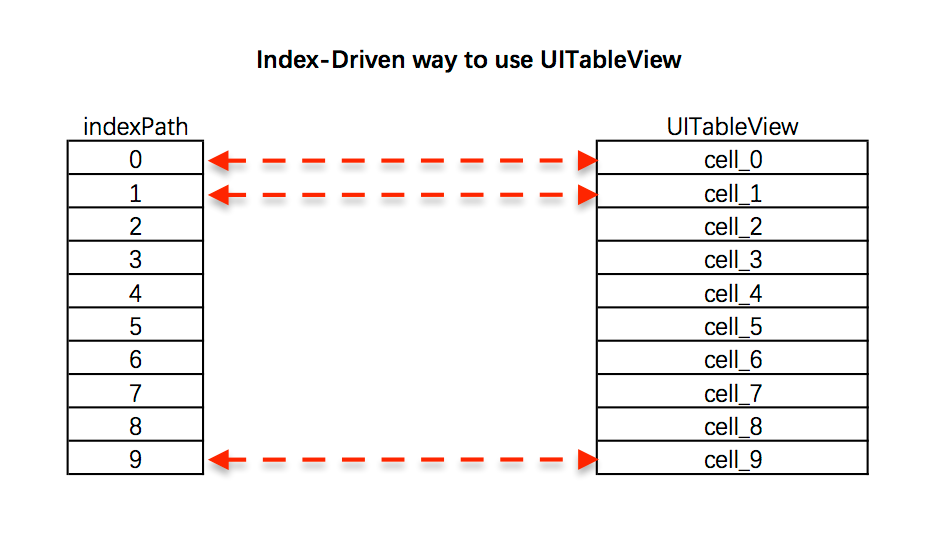
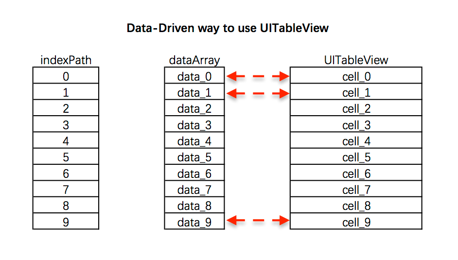

# GPJDataDrivenTableView

## Description

__GPJDataDrivenTableView__ is a data-driven way to use UITableView. It is easy to use. It is friendly to evolve with change of requirements.

## Installation

### CocoaPods

```ruby
pod 'GPJDataDrivenTable'
```

### Manual

1. download the GPJDataDrivenTableView repository
2. copy the GPJDataDrivenTableView sub-folder into your Xcode project

## Origin

The traditional way is index-driven, we implement the UITableViewDataSource's or UITableViewDelegate's methods base on __indexPath__:

- `-tableView:cellForRowAtIndexPath:`
- `-tableView:heightForRowAtIndexPath:`
- `-tableView:didSelectRowAtIndexPath:`

This index-driven way based on __indexPath__ results a lot of `if-else` code segments, Various cells' code mix together. it is error-prone, hard to evolve with change of requirements.



The core role of data-driven way to use UITableView is GPJDataDrivenTableView class. GPJDataDrivenTableView contains UITableView instance and a dataArray, GPJDataDrivenTableView set itself as UITableView's dataSource and delegate, implement the protocol methods, and covert ___indexPath___ to ___data___ in dataArray. Finally we can render cell ui and respond to row selection based on ___data___. 



This data-driven way is simple, easy to implement each kind of data, cell, and select action separately.
